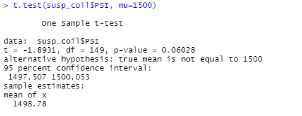

# MechaCar_Statistical_Analysis

## Linear Regression to Predict MPG
* Which variables/coefficients provided a non-random amount of variance to the mpg values in the dataset?
 
  Ground_clearnace and vehicle_length provided a non-random amount of variance. 

* Is the slope of the linear model considered to be zero? Why or why not?
 
  By looking at our p-value, which is less than 0.05, we are able to say it is not considered to be zero. 

* Does this linear model predict mpg of MechaCar prototypes effectively? Why or why not?

  Being that the R-squared value is 71% and the adjusted is 68% we could conclude that this linear model predicts the mpg of the MechaCar prototypes effectively.
 
## Summary Statistics on Suspension Coils

The overall variance does not exceed 100 pounds and therefore meets the design specification. However, individually not all the lots meet the specification. The third lot has a much higher variance which exceeds the 100 pound limit. 

## T-Tests on Suspension Coils
The t-test on the entire lot has a p-value of 0.06, as seen in the image below. Therefore, we can’t reject the hypothesis. 

The t-test results across all lots could be seen below. 

After carefully looking at all the results and the p-values for each, we could conclude that for lots 1 and 2 we fail to reject the null hypothesis. However, for lot 3, at a significance level of 0.05, we could reject the null hypothesis since the p-value is 0.04. 

## Study Design: MechaCar vs Competition
An additional statistical study that can could be performed to quantify how the MechaCar performs against the competition is fuel efficiency. With gas prices being expensive, city or highway fuel efficiency would be of interest to a consumer. In order to do this study, the metrics and data needed are: horsepower, vehicle weight, mpg, and fuel efficiency. A linear regression could be performed in order to determine MechaCar fuel efficiency versus the competition. 
